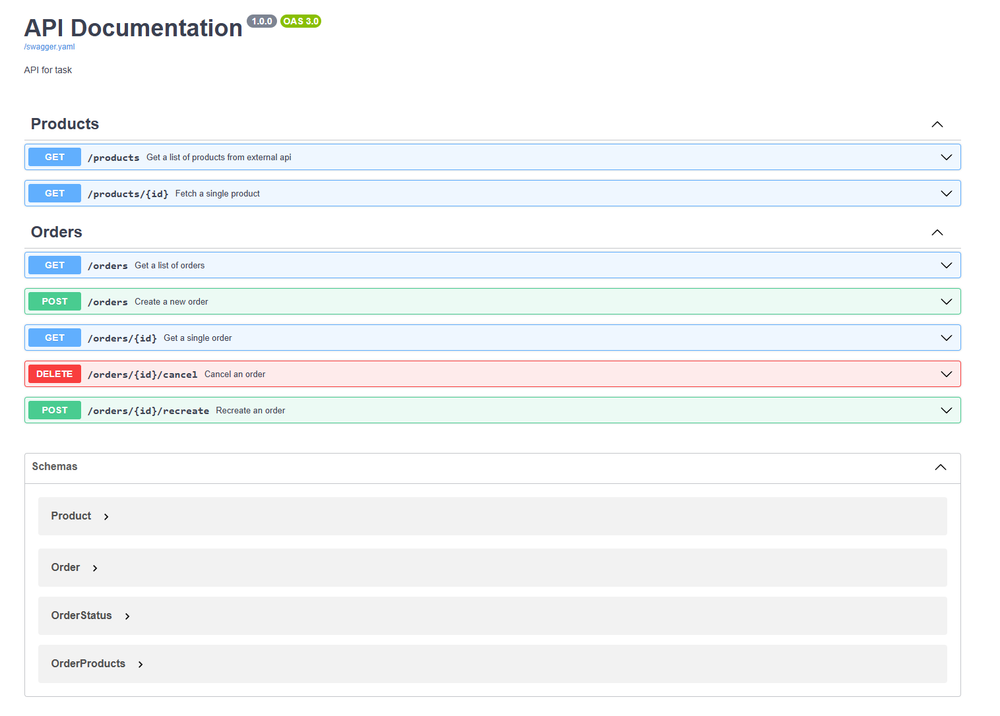

# Order Management System

This project is a backend system for managing orders, built using Symfony. The application allows creating, canceling, and managing orders while leveraging Docker for an easy setup.



---

## Features

- RESTful API for managing orders.
- Integration with Redis for caching.
- Dockerized environment for consistent development and deployment.
- Swagger documentation for API endpoints.

---

## Requirements

- **Docker** and **Docker Compose** installed.
- Basic understanding of PHP and Symfony.

---

## Setup Instructions

### 1. Clone the Repository

```bash
git clone https://github.com/mmiernik-dev/order-managament.git
cd order-managament
```

### 2. Configure Environment

1. Copy the example `.env` file:
```bash
cp .env.dev .env
```
### 3. Build and Run the Project

Use Docker Compose to build and run the application:
   ```bash
   docker-compose up --build -d
   ```

### 4. Install dependencies by composer

Go into php container
   ```bash
   docker exec -it php_app bash
   ```
Install composer dependencies
   ```bash
   composer install --no-dev --no-scripts --optimize-autoloader
   ```

### 5. Init database

Still on docker php_app container run commend to build database 
```bash
php bin/console doctrine:database:create --if-not-exists
php bin/console doctrine:migrations:migrate --no-interaction 
```

## Usage

### API Endpoints

The API is documented using Swagger. After starting the application, you can access the documentation at:

   ```bash
   http://localhost:8080
   ```
#### Example Endpoints:

| **Method**   | **Endpoint**                | **Description**            |
|--------------|-----------------------------|----------------------------|
| `GET`        | `/products`                 | Fetch all products.        |
| `POST`       | `/orders`                   | Create a new order.        |
| `DELETE`     | `/orders/{id}/cancel`       | Cancel an order.           |

## Development Notes

### Running Tests

To run the test suite (on php docker container):

```bash
php bin/phpunit
```

### Rebuild Docker Containers
If you make changes to the Docker setup, rebuild the containers:
```bash
docker-compose down
docker-compose up --build -d
```

## Contributing

1. Fork the repository.
2. Create a feature branch:
   ```bash
   git checkout -b feature-name
   ```
3. Commit your changes:
   ```bash
   git commit -m "Add some feature"
   ```
4. Push to the branch:
   ```bash
   git push origin feature-name
   ```
5. Create a pull request

## License

This project is open-source and available under the MIT License.